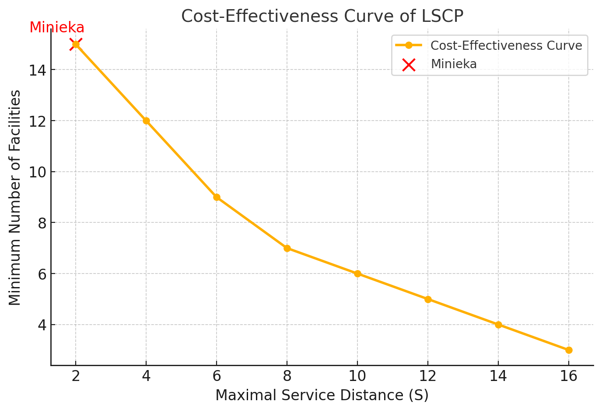
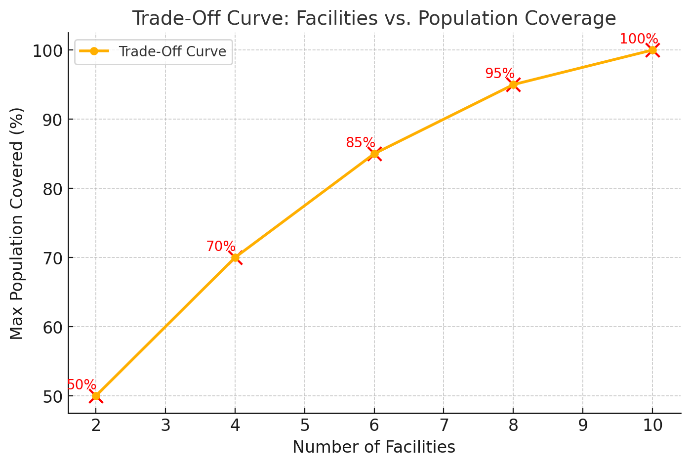
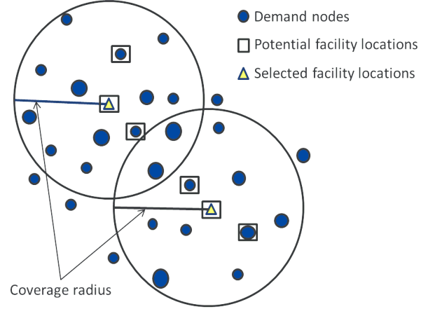
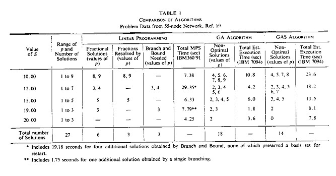
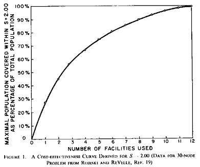
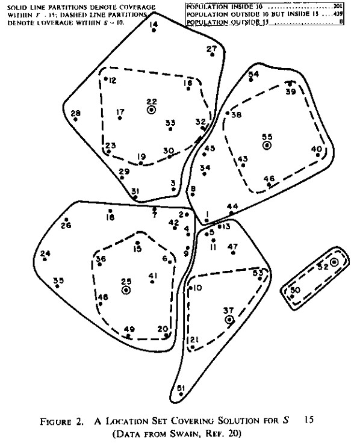
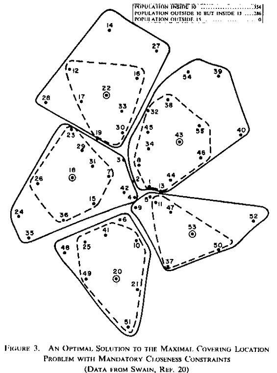
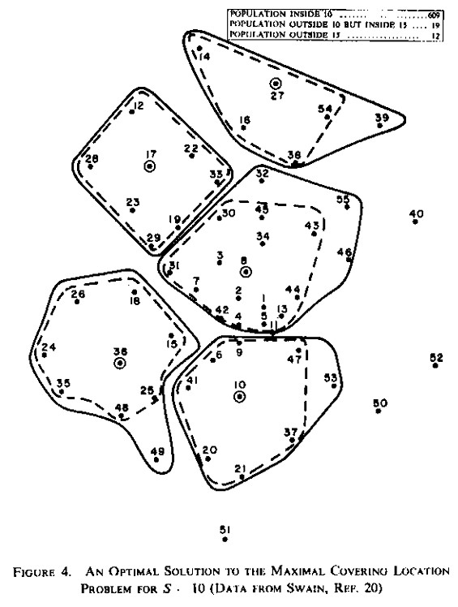

# The Maximal Coverage Location 

*The first section of this research document summarizes and explains Church's research paper, "The Maximal Covering Location Problem." This analysis will serve as the foundation for applying its principles to our project, which aims to optimize the placement of vaccination sites to maximize coverage across Arkansas or within a specific region of the state.*

Church, R., & ReVelle, C. (1974). The maximal covering location problem. *Papers of the Regional Science Association, 32*(1), 101–118. [https://doi.org/10.1007/BF01942293](https://doi.org/10.1007/BF01942293)

---

## Identifying Optimal Location & Building Towards the Maximal Coverage Location Problem
In order for mathematical location modeling to identfiy "optimal" location rest on one basis:

- Ther needs to be a **realistic objective** that can be ***measured*** and ***quantified***.

For <u>private</u> facility location analysis it's more simple to identify this objective. 

- e.g. Objective of locating warehouses is to minimize costs of production and distribution (this can be easily measured & quantified).

#### Public Facility Location Analysis
The basis needed for optimal location modeling is harder to determine when dealing with public facility locations, in our case vaccination sites. This leads to **<mark>surrogate</mark>** measures that represent more complex or difficult-to-define objectives. There are two main surrogate measures used:

(1) Total weighted distance or time for travel to the facilities.

(2) **<mark>Maximal Service Coverage</mark>** - distance or time that the user most distant from a facility would have to travel to reach that facility.
- *This reflects the worst possible performance of the system*.

---

#### Maximal Service Coverage Concept & Location Set Covering Problem (LSCP)
We have to ensure that every demand point (patients) is within a given maximum distance from a facility (vaccination site). *Formulating this maximum distance will be one of our goals in this project.*

We can break the Maximum Service Distance as follows:

(1) **Objective:** 
Determine the **minimum number of facilities** required while ensuring that no demad point is located farther than the **maximal service distance (<mark>\(S\)</mark>)** from the nearest facility. 

(2) **How it Works:**
- Given a set of potential facility locations and demand points, the problem finds the optimal placement of facilities.
- The solution must ensure that each demand point is within distance \(S\) of at least one facility.
- The smaller the maximal service distance, the more facilities will be needed.

(3) **Cost-Effectiveness Curve:**
- By solving the LSCP for different values of \(S\), we obtain pairs of values: **(\(S\), minimum number of facilities needed)**
- Plotting these paris gives a cost-effectivenss curve, showing the trade-off between **service distance (\(S\))** and **the number of facilities** needed.
- This curve helps in decision-making, balancing service quality (lower \(S\)) and cost (fewer facilities).

*This is a Cost-Effectiveness Curve made from dummy data. Made for visual purposes.*

- For a fixed number of vaccination sports it would be beneficial to determine the solution with the smallest maximal service distance. The point is identified as ***Minieka***.
- In location set covering problems the <u>given number of facilities</u> is the *only* cost factor in the decision factor. 
    - For this to be effective unit cost have to be independent of site and number of demand points covered. 
- **Practical Limitations of LSCP:** 
    - Ideally, a decision-maker wants to ensure that **all demand points** are within the \(S\) of a facility.
    - However, in reaility, **available resources (vaccination sites)may be insufficient** to achieve this goal.
    - Instead of **forcing total coverage**, the decision-maker shifts thier focus to maximizing the number of people within distance \(S\) given the limited facilites. 
    - The **new objective** becomes **minimizing the number of people who are left unserved beyond \(S\)**.

---

## Maximal Coverage Location Problem (MCLP)
As stated before, we now look to minimize the number of people who are left unserved beyond \(S\) or in other words **maximizing coverage (population covered) within a desired service distance \(S\)** by locating fixed number of facilities. Let's look into this a further:

- **Trade-Off Curve in Faciliity Location:**
    - A trade-off curve can be developed to show the maximum population coverage possible within the desired service distance (\(S\)) for different levels of expenditure

    
    *This is a Trade-Off Curve made from dummy data. Made for visual purposes.*

    - Decision-makers must evaluate whether the extra cost of adding more facilities is justified or if the funds could be better used elsewhere.

- **Balancing Coverage & Service Quality**
    - While maximizing coverage within distance \(S\) is a priority, the **quality of service** for those **outside** this distance is also important.
    - Ther may exist an **undesirable distance threshold (<mark>\(T\)</mark>)** beyond which no one should be without service.

- **Secondary Distance Constraint**
    - The decision-maker may impose a constraint ensuring **mandatory coverage within a larger distance \(T\)** (where **<mark>\(T\) > \(S\)</mark>**).
    - <mark>The goal is to **maximize population coverage within \(S\)**, while ensuring that **everyone is within \(T\)**</mark>.

---

#### Mathematical Formulation of the Maximal Covering Location Problem
Maximum population which can be served within a stated service distance *or time** given a limited number of facilites. We will have a network of nodes and arcs.
- ****Service distance** or **time** is a decision we will have to consider carefully for our model*

*A feasible solution of the MCLP with two facilities, six potential facility locations, and twenty five demand nodes.*

---

##### **Mathematical Formulation**
Maximize:

\[
z = \sum_{i \in I} a_i y_i
\]

Where:
- \( z \) represents the total population covered.
- \( a_i \) is the population at demand node \( i \).
- \( y_i \) is a binary variable indicating whether demand node \( i \) is covered (1 if covered, 0 otherwise).

##### **Subject to Constraints:**

(1) **Coverage Constraint:**  
   Each demand node \( i \) is covered if at least one facility within distance \( S \) is selected:

   \[
   \sum_{j \in N_i} x_j \geq y_i, \quad \forall i \in I
   \]

   - \( N_i \) is the set of facility locations \( j \) that are within distance \( S \) from demand node \( i \).
   - \( x_j \) is 1 if a facility is placed at location \( j \), otherwise 0.
   - This ensures that a demand node \( i \) is covered if there is at least one facility in its coverage range.

(2) **Facility Limit Constraint:**  
   The total number of selected facility locations cannot exceed a fixed number \( P \):

   \[
   \sum_{j \in J} x_j = P
   \]

   - This enforces a constraint on the total number of facilities that can be placed.

(3) **Binary Constraints:**  
   The facility location variable \( x_j \) and demand coverage variable \( y_i \) are binary:

   \[
   x_j \in \{0, 1\}, \quad \forall j \in J
   \]

   \[
   y_i \in \{0, 1\}, \quad \forall i \in I
   \]

   - \( x_j = 1 \) means a facility is placed at location \( j \), otherwise \( x_j = 0 \).
   - \( y_i = 1 \) means demand node \( i \) is covered, otherwise \( y_i = 0 \).

##### **Definitions:**
- \( I \) = Set of **demand nodes**.
- \( J \) = Set of **facility sites**.
- \( S \) = Maximum **service distance**, beyond which a demand node is considered "uncovered".
- \( d_{ij} \) = **Shortest distance** from demand node \( i \) to facility site \( j \).
- \( P \) = **Maximum number of facilities** that can be placed.

---

##### **What if we have to consider \( T \)?**
As we mentioned earlier, in some cases, a decision-maker might also want to ensure that no demand point is too far from a facility, even if it falls outside the ideal coverage distance 

This additional constraint guarantees that **no demand node is left unserved beyond distance \( T \)**. While the original model maximizes coverage within **\( S \)**, some demand nodes may still remain uncovered. The inclusion of \( T \) ensures a minimum level of accessibility, improving **fairness** in facility placement while maintaining optimal coverage within \( S \).

\[
\sum_{j \in M_i} x_j \geq 1, \quad \forall i \in I
\]

Where:
- \( M_i \) is the set of facility sites within distance \( T \) from demand node \( i \).
- This ensures that **every demand node is covered within \( T \)**, even if it is outside \( S \).
- This introduces an **equity constraint**, preventing locations from being too far from a facility.

---

#### Equivalent Formulation and Linear Programming Approach

##### **Is Linear Programming Needed?**
There is an **equivalent formulation** of the **Maximal Covering Location Problem (MCLP)** that is necessary for solving it using **linear programming (LP)**. The original formulation involves a **maximization objective with binary variables**, but through a variable transformation, it can be rewritten as a **minimization problem**, which is often more convenient for certain LP solvers.

##### **Why Use Linear Programming?**
1. **Mathematical Equivalence**  
   - The original **maximization** problem can be transformed into a **minimization** problem using variable substitution.
   - This ensures that the formulation remains linear and solvable using **standard LP methods**.

2. **Computational Efficiency**  
   - Solving MCLP directly as a **combinatorial problem** can be computationally expensive.
   - Reformulating it into an LP problem allows for efficient **optimization techniques**, such as **branch-and-bound** or **cutting-plane methods**.

---

##### **Step 1: Define the Complementary Variable**
Introduce \( \bar{y}_i \), which represents whether **demand node \( i \) is uncovered**:

\[
\bar{y}_i =
\begin{cases} 
1, & \text{if demand node } i \text{ is NOT covered within } S \\ 
0, & \text{otherwise}
\end{cases}
\]

This substitution follows from the fact that:

\[
y_i = 1 - \bar{y}_i
\]

where:
- \( y_i = 1 \) means node \( i \) is covered.
- \( \bar{y}_i = 1 \) means node \( i \) is **not covered**.

---

##### **Step 2: Transform the Coverage Constraint**
Original coverage constraint:

\[
\sum_{j \in N_i} x_j \geq y_i, \quad \forall i \in I
\]

Substituting \( y_i = 1 - \bar{y}_i \):

\[
\sum_{j \in N_i} x_j \geq 1 - \bar{y}_i, \quad \forall i \in I
\]

which is equivalent to:

\[
\sum_{j \in N_i} x_j + \bar{y}_i \geq 1, \quad \forall i \in I
\]

This means that for each demand node \( i \), **either it is covered by at least one facility, or it remains uncovered (\( \bar{y}_i = 1 \))**.

---

##### **Step 3: Reformulate the Objective Function**
The original **maximization** objective was:

\[
\max \sum_{i \in I} a_i y_i
\]

Using \( y_i = 1 - \bar{y}_i \), we get:

\[
\max \sum_{i \in I} a_i (1 - \bar{y}_i)
\]

which simplifies to:

\[
\max \sum_{i \in I} a_i - \sum_{i \in I} a_i \bar{y}_i
\]

Since \( \sum_{i \in I} a_i \) is a known constant, **maximizing this function is equivalent to minimizing the uncovered population**:

\[
\min \sum_{i \in I} a_i \bar{y}_i
\]

---

##### **Final Equivalent Formulation**
The **revised minimization problem** becomes:

**Objective Function:**
\[
\min \sum_{i \in I} a_i \bar{y}_i
\]

**Constraints:**
1. **Coverage Constraint (Rewritten)**
   \[
   \sum_{j \in N_i} x_j + \bar{y}_i \geq 1, \quad \forall i \in I
   \]
   - Ensures each demand node \( i \) is either covered by at least one facility or marked as uncovered.

2. **Facility Limit Constraint**
   \[
   \sum_{j \in J} x_j = P
   \]
   - Limits the number of facilities to \( P \).

3. **Binary Constraints**
   \[
   x_j \in \{0, 1\}, \quad \forall j \in J
   \]
   \[
   \bar{y}_i \in \{0, 1\}, \quad \forall i \in I
   \]
   - The reformulation makes the problem more structured and suitable for **Integer Linear Programming (ILP)** solvers by converting it into a minimization problem with a well-defined constraint structure.
   -  However, the facility placement variables (\(x_j\)) and uncovered demand indicators (\(\bar{y}_i\)) remain binary because they represent **discrete decisions**—a facility is either built or not, and a demand node is either covered or not.
   - While this does not make it a pure **Linear Program (LP)**, it allows the use of **LP-based optimization techniques** like branch-and-bound to solve the problem more efficiently.

---

## Solution Techinques

#### Heuristic Approaches
*Hueristic Approach- problem-solving or decision-making technique that uses practical methods and "rules of thumb" to find a satisfactory solution, prioritizing speed and practicality over complete optimization or accuracy*

##### <mark>Greedy Adding (GA) Algorithm</mark>

**Goal:** achieve a maximal cover for \(p\) faciliites under a given service distance.

**(1)** Start with a an empty solution set
**(2)** Add to this set one at a time the best facility sites.
- First facility picked is the site that covers the most of the population.
- Second facility picked is the site that covers the most of the population *not* covered by the first facility.
- Third facility picked is the site that covers the most of the population *not* covered by the first and second facilities.
- This process is reapeated until either \(p\) facilities have been selected or all the population is covered.

**Caveat to GA Algorithm**
- Although one-facility maximal covering solution obtained by the GA algorithm is optimal, solutions where \(p\) is greather than 1, ***optimality is not guaranteed***. 
    - GA algorithm never removes facility sites from the solution set.
    - Facilities that were added in early iterations may not be justified later in the algorithm as we keep adding facilites.
    - **"No longer justified"** sites would imply nonoptimality. 

How do we reduce the probability of keeping "no longer justified" sites in the solution set?

##### <mark>Greedy Adding with Substitution (GAS) Algorithm</mark>
This algorithm builds on the GS algorithm by **adding** the site that provides the largest marginal improvement in coverage at each step.

- Not only adds new facilities but also **swaps** out existing facilites in an attempt to immprove the soluion. 
- At each iteration it evaluates whether **replacing an already chosen facility with one at a "free" site** would result in a better objective value.
- If an improvement is possible, the **swap is made with the site that maximizes the increase in covereage.** This is called the *refinement step*
- It's still not an optimal soultion, but *near-optimal.*

Why is GAS not globally optimal?
- GAS **allocates facilites one at a time** (greedy approach)
- It **makes local improvements** by swapping sinlge facilities but **does not explore ALL possible swaps simultaneously.**
- Can get stuck in local optima because it only swaps one facility at a time rather than exploring all possible swaps (only guarentees **best local solution**)

---

## Linear Programming
Linear programming (LP) can be applied to the Maximal Covering Location Problem to find **globally optimal solutions**. 
- Binary constraints on \(x_j\) and \(y_i\) (which wer 0 or 1) are **relaxed** to allow them to be **continuous variables** between 0 and 1 (we can use LP solvers now)*. 
    - **This applies to both models mentioned in the *Maximal Coverage Location Problem (MCLP)* section of this document*

**Properties of the Optimal LP Solution**
- At optimality, \(x_j\) **will never be greater than 1** unless **total coverage is achieved**. 
- If any \(x_j\) were greater than 1, it could be reduced to 1 without violating constraints, while redistributing coverage to improve the objective function. 
- Since the objective function minimizes uncovered population, **naturally keeps values of \(x_j\) and \(y_i\) as small as possible.**
- Therefore, the optimal LP soultions will have:

\[
0 \leq x_j \leq 1, \quad \forall j \in J
\]

\[
0 \leq y_i \leq 1, \quad \forall i \in I
\]

**Possible Outcomes of the LP Soultion**
- **Case 1: "All-integer answer"**- If the LP solution results in all \(x_j\) and \(y_i\) being either 0 or 1, the *optimal solution* to the MCLP has been found. 
- **Case 2: "Fractional answer"**- If some \(x_j\) and \(y_i\) values are fractional (between 0 and 1), the solution is *not feasible* for the **original zero-one problem**. 
    - Additional work (such as **rounding** or **integer programming techniques**) is needed to obtain a valid binary solution. 

**Lower Bound & Postoptimal Analysis**
- **Lower Bound Insight:** Even if the LP solution contains fractional values, it provides a lower bound on the optimal objective function, helping guide further integer optimization.
- **Efficient Multi-Solution Computations:** Using <u>postoptimal analysis</u>*, solutions for multiple values of **\(P\)** (number of facilities) were quickly computed, significantly reducing computational costs compared to solving each instance independently. 
    - **Postoptimal analysis** is the process of analyzing how changes in problem parameters (such as constraints or objective function coefficients) affect the optimal solution of a mathematical optimization model.
    - In linear programming, it allows for efficiently computing solutions for multiple values of a key parameter (e.g., the number of facilities \(P\)) without resolving the entire problem from scratch, reducing computational costs.

---

## Resolving Fractional Solution to the Linear Program

##### **1. Frequency of Fracitonal Solutions**
- **80% of the time**, the linear programming (LP) solution is already **binary (0 or 1)**.
- **20% of cases** require additional steps to **resolve fractional values**.
- Two techniques are used to convert fractional LP solutions into integer solutions:
  1. **Method of Inspection**
  2. **Branch and Round Method**

---

##### **2. Method of Inspection (Using Previous Solutions)**
- In some cases, an **all-integer optimal solution** for \( P \) facilities can be derived from:
  - The **fractional LP solution for \( P \)**.
  - The **optimal integer solution for \( P - 1 \)**.
- **Example (55-node network):**
  - **\( P = 7 \)** facilities cover **all but two nodes (A and B)**.
  - **\( P = 8 \) (fractional LP solution)** covers **639 out of 640**.
  - Since the **smallest node population is 2**, an optimal **integer solution for \( P = 8 \)** must cover **at most 638 or 640**.
  - Adding **node A** to the **7-facility solution** creates an **integer 8-facility solution** covering 638, proving its **optimality**.
  - **\( P = 9 \)** can **fully cover the network (640)**, making it **the best integer solution**.

**Key Takeaway**
- The **previous integer solution (for \( P - 1 \))** can often be used to derive an **integer solution for \( P \)** without full recomputation.

---

##### **3. Branch and Round Method**
- Used when the **Method of Inspection does not work**.
- If an LP solution contains **fractional values**, we create two new versions of the problem:
  1. **One where a chosen facility variable \( x_j \) is set to 1 (facility is built).**
  2. **One where \( x_j \) is set to 0 (facility is not built).**
- Both new problems are solved separately.
- If either solution results in **all integer values**, we pick the one with the **best objective value**.
- If a solution still has **fractional values**, we repeat the process on another variable until all values become **0 or 1**.

**Key Takeaway:**  
- **Branch and Round eliminates fractional solutions** through **iterative branching**, ensuring an optimal **integer solution**.

---

##### **4. Final Summary**
- **Most LP solutions are already integer**, but **fractional cases require additional techniques**.
- **Method of Inspection** efficiently derives integer solutions from prior solutions.
- **Branch and Round** systematically eliminates fractional values through **recursive LP solving**.
- These methods ensure an **optimal integer solution** is found **without resorting to full integer programming from the start**.

---
## Performance of the Algorithms

##### **1. Test Networks and Problem Setup**
- Two networks were used to **evaluate the performance of heuristics and linear programming approaches**:
  1. **30-node network** (designed by Rojeski and ReVelle).
  2. **55-node network** (described by Swain).
- Each demand node was considered a **potential facility site**.
- The **optimal linear programming approach** was applied to many problems using the 55-node network.
- Fractional solutions in LP were first resolved using the **Method of Inspection**, and if unsuccessful, **Branch and Bound** was applied.

---

##### **2. Comparison of Algorithm Performance**
- **27 maximal covering problems** were solved using the **MPS system**.
- LP combined with the **Method of Inspection** solved **90% of the problems**.
- **Branch and Bound was needed only 10% of the time**.
- The **GA (Greedy Adding) algorithm** was **nonoptimal more than 60% of the time**.
- The **GAS (Greedy Adding and Swapping) algorithm** was **nonoptimal about 50% of the time**.
- **Despite being heuristic-based, GA and GAS consistently found solutions that covered at least 90% of the optimal solution’s coverage**.

---

##### **3. Explanation for Heuristic Performance**
- The **high density** of the 55-node network contributed to **good performance** for heuristics.
- The **first facility placed in the solution typically had a very large coverage**, making it a dominant factor in the solution.
- The **impact of additional facilities** was relatively smaller, which meant **heuristic decisions were often close to optimal**.

---

##### **4. Value of Having an Optimal Solution**
- **The quality of heuristic solutions could only be assessed because an optimal solution was available for comparison**.
- If enumeration had been required to determine optimal solutions, the **computational cost would have been too high**.

---

##### **5. Cost-Effectiveness Curve and Decision Making**
- By **holding the service distance \( S \) fixed** and solving for different numbers of facilities \( P \), a **cost-effectiveness curve** was created.
- This curve shows how **population coverage increases as more facilities are added**, but with **diminishing returns**.
- **Decision-making insight:**  
  - Even if funds exist for **12 facilities** (100% coverage), an **8-facility solution with 90% coverage** might be **more cost-effective**.
  - The **savings** from using fewer facilities could be **reallocated to other improvements**.

---

##### **6. Key Takeaways**
- Linear programming with postoptimal analysis efficiently finds optimal solutions.
- GA and GAS heuristics perform well, covering at least 90% of the optimal solution.
- Dense networks help heuristics perform better by making initial facility placements highly impactful.  
- Cost-effectiveness curves help decision-makers balance coverage against facility costs.

---

## Maximal Covering with Mandatory Closeness Constraints

##### **1. Introduction to Mandatory Closeness Constraints**
- The **Maximal Covering Location Problem (MCLP)** aims to **maximize coverage within a desirable service distance \( S \)**.
- However, some demand points might be **too far from facilities**, making service **inequitable**.
- To address this, a **mandatory closeness constraint** is introduced:
  - **Every demand point must have at least one facility within a maximum distance \( T \) (where \( T > S \))**.
  - This ensures **fairness** by preventing demand points from being too far from facilities.
- The problem now requires **locating \( p \) facilities** to:
  1. **Maximize population coverage within \( S \)**
  2. **Ensure that all demand points are within \( T \)**

---

##### **2. Mathematical Formulation**
- The problem keeps the same **objective function** and **facility constraints** as before.
- There are now **two coverage constraints**:
  1. **Standard Maximal Covering Constraint** (Ensures demand is covered within \( S \)):  
     \[
     \sum_{j \in N_i} x_j \geq y_i, \quad \forall i \in I
     \]
     - Where \( N_i \) is the set of facilities within **\( S \)** of demand node \( i \).
  2. **Mandatory Closeness Constraint** (Ensures no demand is farther than \( T \)):  
     \[
     \sum_{j \in M_i} x_j \geq 1, \quad \forall i \in I
     \]
     - Where \( M_i \) is the set of facilities within **\( T \)** of demand node \( i \).
     - Since \( T > S \), we always have \( M_i \supseteq N_i \).

**Key Difference:** Unlike the standard MCLP, this model **only has feasible solutions for certain values of \( p \)** (minimum number of facilities needed to ensure coverage within \( T \)).

---

##### **3. Finding the Best Solution**
- If the smallest number of facilities needed to cover all within \( T \) is **\( p^* \)**, then:
  - The **\( p^* \)-facility solution is optimal for location set covering**.
  - There may be **multiple** \( p^* \)-facility solutions that achieve total coverage within \( T \).
  - Among these solutions, we choose the one that **maximizes coverage within \( S \)**.

**Benefit:** This approach **improves coverage within \( S \) while ensuring fairness within \( T \)**.

---

##### **4. Computational Results**
- Solved using **linear programming (LP)** by **minimizing uncovered demand within \( S \)** while ensuring full coverage within \( T \).
- **IBM MPS360 system** was used, with postoptimal analysis applied to solve for different values of \( p \).
- **8 out of 11 LP problems** resulted in all-integer solutions, making them optimal for the **zero-one problem**.
- The remaining fractional solutions were resolved using the **Method of Inspection**.

**Efficiency:** Almost all solutions were obtained without the need for complex integer programming techniques.

---

##### **5. Example: 55-Node Network (Service Distance \( S = 15 \))**
- A **location set covering solution** was computed for **\( S = 15 \)** on a **55-node network**.
- **Figure 2** illustrates the coverage:

  - **Solid line partitions** show coverage **within \( S = 15 \)**.
  - **Dashed line partitions** show coverage **within \( S = 10 \)**.
- **Key observation:**  
  - **201 people** are covered within **\( S = 10 \)**.
  - **Remaining 439 people** are between **\( S = 10 \) and \( S = 15 \)**.

---

##### **6. Improving Solutions Using Mandatory Closeness Constraints**
- The **MCLP with mandatory closeness constraints** can help select **better location set covering solutions**.
- Instead of just solving for **\( S = 15 \)**, we also solve for **\( S = 10 \) and \( T = 15 \)**.
- **Figure 3** illustrates the best solution:

  - **354 out of 640 people are covered within \( S = 10 \)** while still maintaining full coverage within \( S = 15 \).
  - **This is a 75% improvement** in population covered within \( S = 10 \).

**Key Insight:**  
- This approach ensures that as much demand as possible is **served within a desirable closer distance** while **still covering everyone within \( T \)**.

---

##### **7. Further Analysis and Decision-Making**
- If the decision maker **relaxes the mandatory closeness constraint at \( T = 15 \)**, a **better solution can be found**.
- **Figure 4** shows that by removing the \( T = 15 \) constraint:

  - **609 out of 640 people** can be covered within **\( S = 10 \)**.
  - Only **4 nodes (totaling 12 people) remain uncovered within \( T = 15 \)**.
- This creates a **trade-off**:
  - **Maintaining \( T = 15 \)** forces **255 people outside \( S = 10 \)**.
  - **Relaxing \( T = 15 \)** allows **more coverage within \( S = 10 \)** but leaves **a small population uncovered**.

**Decision-Maker Considerations:**  
- If improving **service within \( S = 10 \)** is **more important**, relaxing \( T \) may be justified.
- If ensuring **everyone is covered within \( T = 15 \)** is crucial, the previous solution is preferred.

---

##### **8. Summary and Key Takeaways**
- MCLP with mandatory closeness ensures fairness in facility placement. 
- LP efficiently finds solutions while minimizing uncovered demand within \( S \).
- This approach refines location set covering solutions to maximize coverage at smaller, more desirable distances. 
- Decision makers can balance trade-offs between improving local coverage and maintaining a stricter maximum service distance.